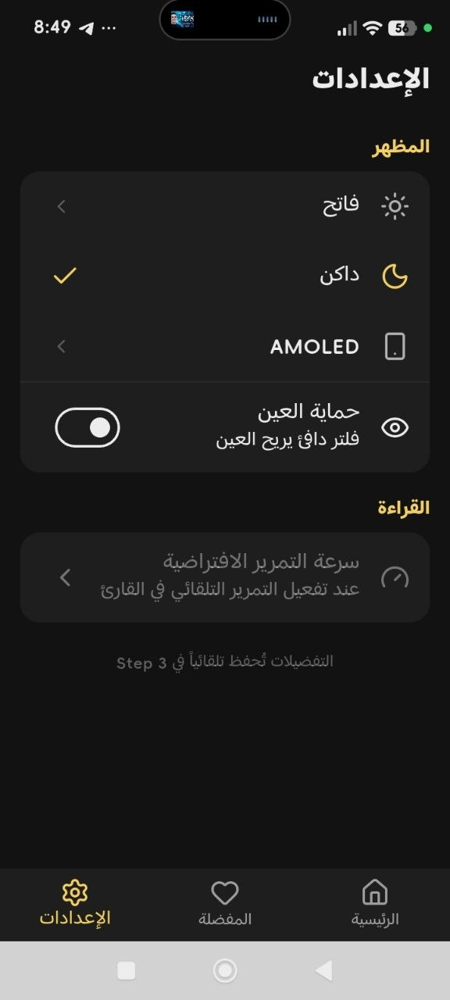
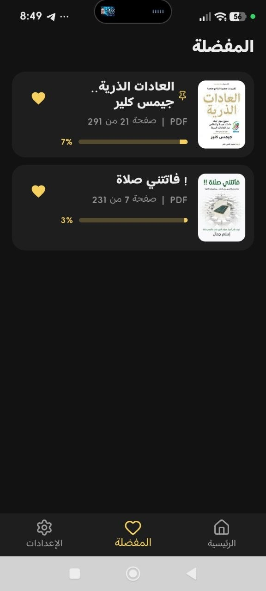
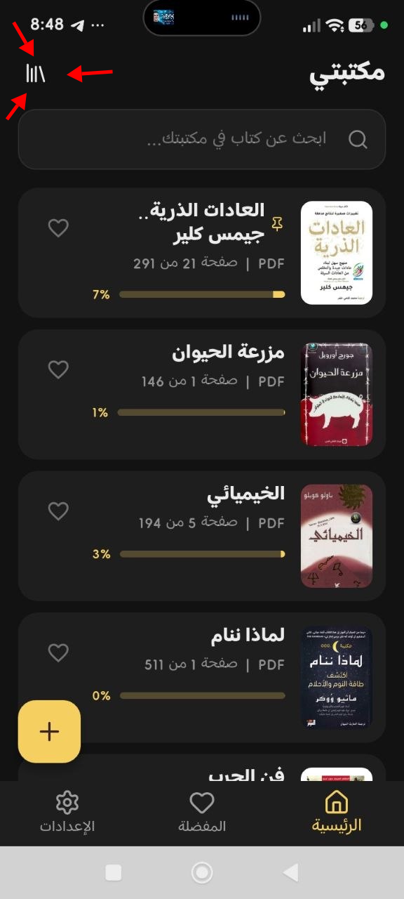
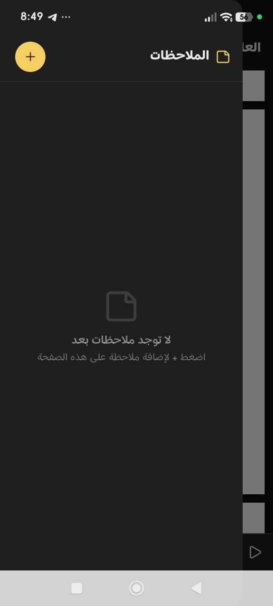
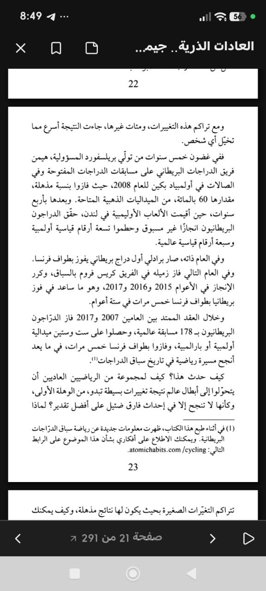
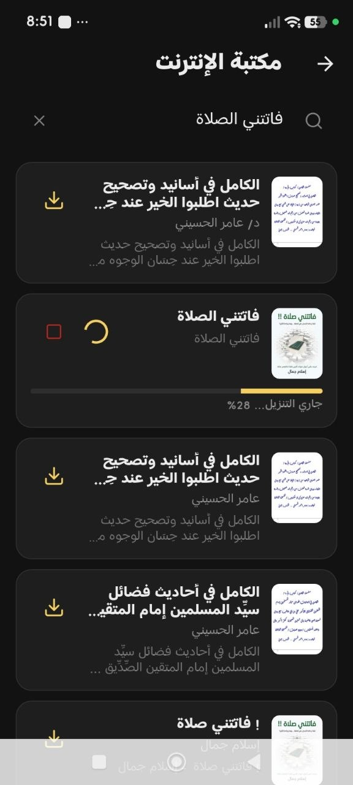
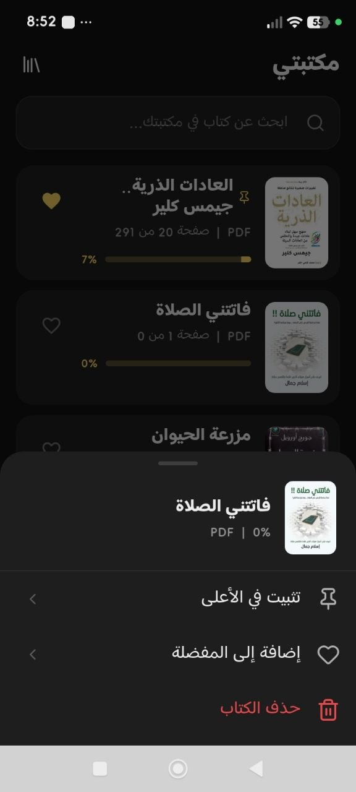

<div align="center">
  
  <h1>مداد</h1>
  <h3>قارئ الكتب العربي — اقرأ، احفظ، رتّب</h3>
  <p>«اقْرَأْ بِاسْمِ رَبِّكَ الَّذِي خَلَقَ» — العلق: 1</p>
</div>

---

قارئ كتب بسيط وصادق للهواتف. يفتح كتابك ويقف جانبك حتى آخر صفحة — بلا إعلانات، بلا تعقيد، بلا فلسفة.

## لقطات الشاشة

<p align="center">
  
  
  
</p>

<p align="center">
  
  
</p>

<p align="center">
  
  
  
</p>

<p align="center">
  
</p>

## التحميل المباشر

حمّل أحدث نسخة مباشرة:

* [**Midad v0.1.0 — arm64** (الهواتف الحديثة)](Midad-v0.1.0-arm64.apk) — 28 MB

أو من الكود:

```bash
git clone https://github.com/ID-KM/midad.git
cd midad
flutter pub get
flutter run
```

## المميزات

* **قراءة سلسة**: مرّر بين صفحات PDF دون توقف — كل صفحة تظهر فوراً وتتحسن أثناء الحركة، لا انتظار ولا قفزات.

* **دعم EPUB كامل**: فصول متصلة، اتجاه RTL سليم، وتحكم بحجم الخط يناسب عينك.

* **مكتبة Archive.org في جيبك**: ابحث عن أي كتاب عربي، حمّله بضغطة، وابدأ القراءة — كل شيء داخل التطبيق.

* **تحميل بضمير**: إشعار بمقدار التقدم لحظة بلحظة، وزر إيقاف يتركك سيد القرار.

* **كتبك في مكانها الطبيعي**: التحميل يذهب إلى مجلد `Download/مداد` — تراه في مدير الملفات، وتنسخه، وتشاركه مع صديق.

* **عين مرتاحة**: وضع حماية للعين قابل للتعديل، ومظهرك المحفوظ يبقى كما تركته.

* **ملاحظات لا تضيع**: دوّن على أي صفحة، وارجع إليها بضغطة واحدة.

* **مكتبة شخصية**: كتبك المفضلة في مكان واحد، بترتيبك أنت.

## التقنيات

* **Flutter** — واجهة عربية كاملة RTL
* **pdfrx** — محرك PDFium لعرض PDF سريع
* **Archive.org API** — بحث وتحميل مجاني
* **MediaStore** — حفظ عام يعمل على أندرويد 10+
* **flutter_local_notifications** — إشعارات التحميل

## بنية المشروع

```
lib/
├── core/          # الثيم وحماية العين
├── data/          # النماذج والخدمات (Archive، EPUB، الإشعارات)
├── presentation/  # الشاشات والمكونات
└── state/         # إدارة الحالة (المكتبة، الملاحظات، المظهر)
```

## الرخصة

مشروع مفتوح — راجع [GitHub](https://github.com/ID-KM/midad) للتواصل والمساهمة.
